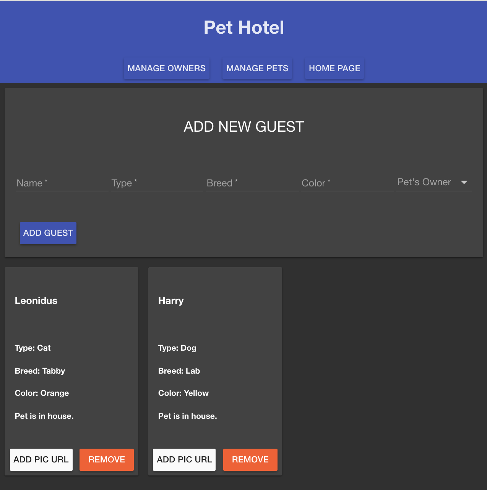
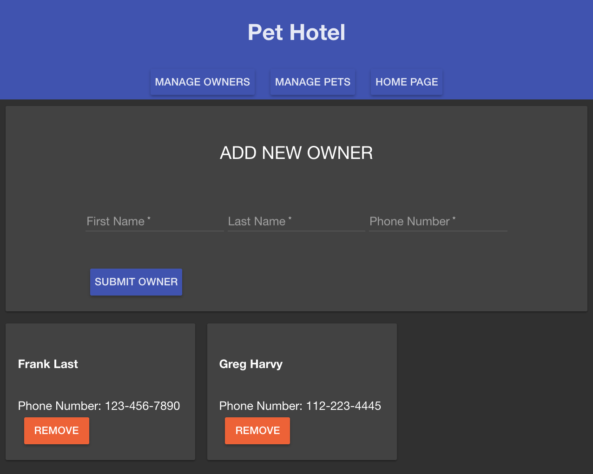

Features
Add owners
Add pets
Remove owners if no pets are assigned
Remove pets
Check in / out a pet
Show total number of pet next to each owner
Wireframes
Add Entry Page


# Name of Project: Project Pet Hotel

Be able to create owners and assign newely created pets to database. Also be able to track if a pet is currently in house or not.

## Built With

angular, angular-material, moment.js, postgresql, pg.

## Getting Started

These instructions will get you a copy of the project up and running on your local machine for development and testing purposes. See deployment for notes on how to deploy the project on a live system.

### Prerequisites

Link to software that is required to install the app (e.g. node).

- [Node.js](https://nodejs.org/en/)
- [postgresql] (https://www.postgresql.org/docs/)


### Installing

Steps to get the development environment running.

DATABASE NAME: pet_hotel

```sql
CREATE TABLE pets(
	id SERIAL PRIMARY KEY,
	owner_id INT REFERENCES "owner" ON DELETE CASCADE,
	name varchar(255),
	type varchar(255),
	breed varchar(255),
	color varchar(255),
	checked_in boolean DEFAULT true
	);
	
CREATE TABLE owner(
	id SERIAL PRIMARY KEY,
	first_name varchar(255),
	last_name varchar(255),
	phone_number varchar(255)
	);

CREATE TABLE pictures(
    id SERIAL PRIMARY KEY,
    pic_url varchar(255),
    pet_id INT REFERENCES "pets"  ON DELETE CASCADE,
    owner_id INT REFERENCES "owner"  ON DELETE CASCADE
);
```

## Screen Shot





### Completed Features

list of items completed.

PROGRESS:
- [x] basic file structure.
- [x] pool.js
- [x] set up server.js and map out routes
- [x] create sql tables and plan for data...
- [x] link all controllers to service
- [x] correctly source all js and css from angular and custom
- [x] server side GET routes.
- [x] client /dashboard post and get routes working
- [x] client /manage post and get routes working

### Next Steps

Features that you would like to add at some point in the future.

- [x] Angular Material for design
- [ ] Keep track of visits (you may need another table or two for this)
- [/] Add images for pets -- was only able to upload picture url but not pull it from the table with other relevant data.
- [ ] Update pets and owners

## Deployment

https://mysterious-inlet-12479.herokuapp.com/#!/home

## Authors

* Teagan Nouska
